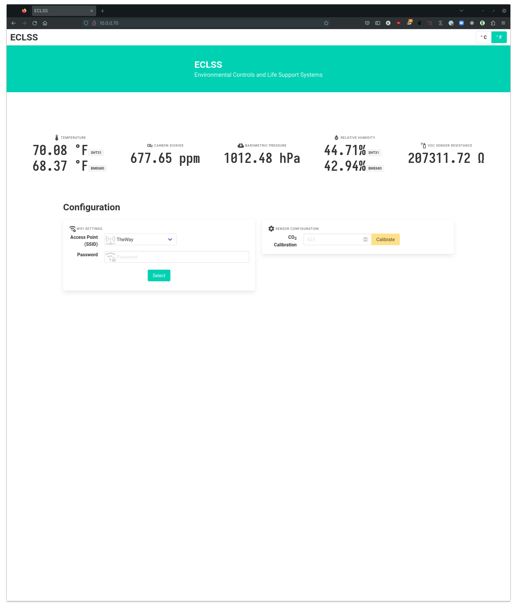
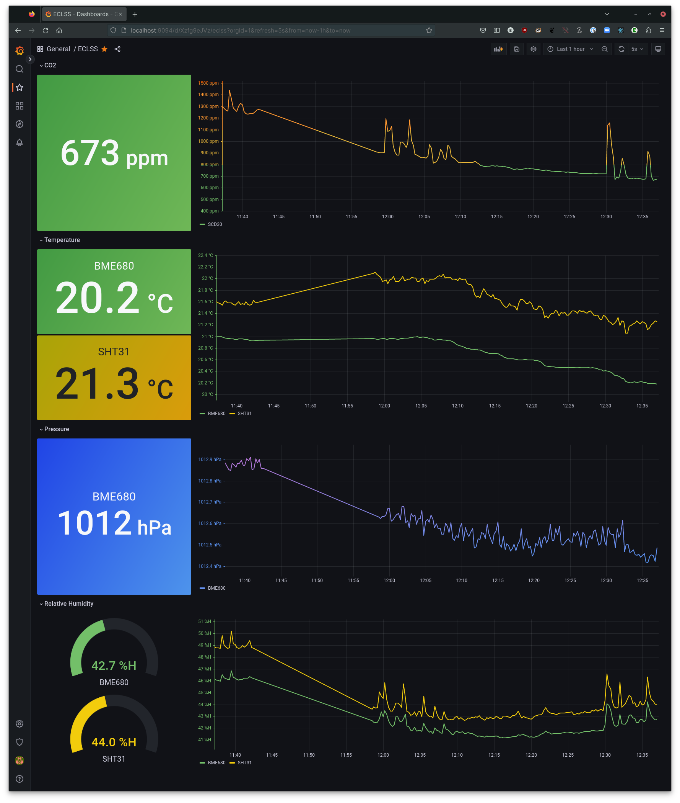

# Eliza's Custom Life Support System (ECLSS)

a fast, cheap, and out of control IoT environmental sensor node.

## what is it?

ECLSS (the [NASA acronym for "Environmental Control and Life Support
Systems"][nasa]) is an ESP32-based implementation of a WiFi-enabled
environmental & air quality sensor node that reads data from a variety of
I2C sensors and exposes data in [the prometheus metrics
format][prom].

[nasa]: https://www.nasa.gov/centers/marshall/history/eclss.html

## hardware

- **microcontroller**: ESP32-C3. i'm using the [QT Py ESP32-C3 from
  Adafruit][qtpy].

  the software could easily be tweaked to work with any ESP32-C3 board with a
  few source changes (e.g. which pins are I2C). i picked the QT Py
  board because it's small and cute and has a [Stemma QT connector][stemmaqt].
- **sensors**:
  > **Note**
  > note that any given sensor is optional; the software gracefully handles
  > missing sensors and will continue to collect data from other sensors if one
  > isn't present on the I2C bus. of course, if you're missing a
  > particular sensor, you won't be collecting the data it measures :)

  + **[Sensirion SCD30][scd30] NDIR CO2 sensor** (with temperature
    and relative humidity).
  + **[Bosch BME680][bme680] temperature, barometric pressure, humidity, and
    VOC** (MOX gas sensor). i meant to get the slightly newer BME688 breakout
    but i clicked the wrong one. a BME688 would also work.
  + **[Plantower PMSA003I][pmsa003i] particulate matter sensor**, measuring
    particulate matter concetrations.
  + **more sensors coming soon!** there are several different I2C
    air quality sensors, and even more different temperature/pressure/humidity
    sensors, on the market. eventually, i'd like to add drivers for most of the
    commonly-available sensors, so you can just plug in whichever ones you're
    able to get easily or already have lying around...
- **human interfaces**:
  + no display yet! i'm thinking an e-ink display might be cool...
  + i'm using the Neopixel LED on the QT Py board as a wifi status indicator.
- **misc**:
  + **[TCA4307] hot-swap I2C buffer** (OPTIONAL). this is *totally
    optional*; it allows hot-swapping [Stemma QT][stemmaqt] sensors without the
    risk of the I2C bus getting stuck. in practice, you're probably
    not going to hot-swap the sensors, but my software supports
    hot-disconnection and reconnection of sensors so it's a fun litle tech demo...

[qtpy]: https://www.adafruit.com/product/5405
[scd30]: https://www.adafruit.com/product/4867
[bme680]: https://www.adafruit.com/product/3660
[pmsa003i]: https://www.adafruit.com/product/4632
[TCA4307]: https://www.adafruit.com/product/5159
[stemmaqt]: https://learn.adafruit.com/introducing-adafruit-stemma-qt/what-is-stemma-qt

## software

- runs a WiFi access point (SSID: `eclss`) for configuration. connect to `eclss`
  and open `http://192.168.71.1` (or `eclss.local`, if your browser/device
  resolves mDNS hostnames) to configure the SSID and password of a WiFi
  access point to connect to.
- exposes an HTTP server on port 80 with a (mobile-friendly, reactive) web UI at
  `/` and [prometheus metrics][prom] at `/metrics`:

  

- advertises the following mDNS services with the hostname `eclss.local`:
  + `_http._tcp`
  + `_https._tcp`
  + `_prometheus-http._tcp`
  + `_prometheus-https._tcp`
- the `_prometheus-http`/`_prometheus-https` mDNS services would allow something
  like [`msiebuhr/prometheus-mdns-sd`] to automatically discover ECLSS scrape
  targets.
- [grafana dashboard](../viz/grafana.json) you can add to a Grafana instance to
  display ECLSS prometheus metrics:

  

[prom]: https://prometheus.io/docs/instrumenting/exposition_formats/#text-based-format
[`msiebuhr/prometheus-mdns-sd`]: https://github.com/msiebuhr/prometheus-mdns-sd

## building and running it

see [BUILD.md](../BUILD.md) for details.
